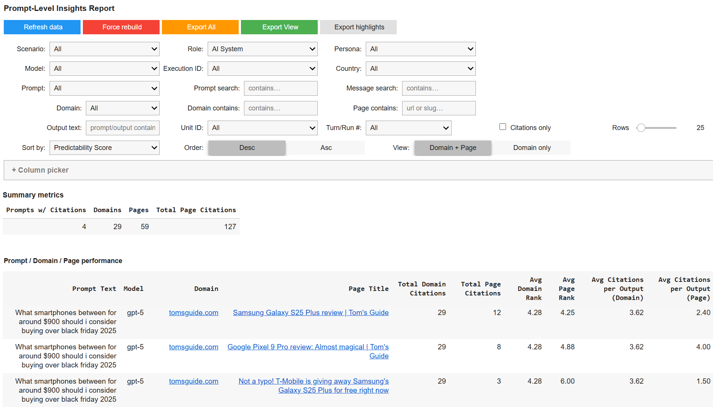

# Open Source AI Visibility For Everyone!

OpenCite makes LLM citations transparent. Anyone--content creators, researchers, SEOs, or curious readers--can trace which URLs appear in model answers, how often they repeat, and how rankings shift as prompts, personas, or locations change.

Clone the repo, choose a workspace (locally or in Colab), and start recording the citation trails behind your own prompts. Every run is logged so you can diff, share, or question each source.

## Map how LLMs surface knowledge

Switch between prompt-level, domain-level, and persona-driven cells to see what the models cite, how attention shifts, and where you can win visibility.

### Prompt-Level Views
Inspect every prompt you run and see the domains and pages cited, their average ranks, and how often they appear across runs.

### Domain & Page Reports
Aggregate citations to root domains or drill down to individual URLs with 26+ metrics covering visibility, reach, and momentum.

### Multi-Run & Persona Cells
Re-run prompts, simulate personas, or bias location to observe how the same topic pulls different sources over time.

### Workspace Agnostic
Use local notebooks or Colab interchangeably. OpenCite keeps your setup portable between environments.

## Reproducible workflows

Keep citations open and auditable. ReportHelper logs every execution as raw JSON plus detail and summary CSVs so you always have an auditable trail. Shared workspace folders store search results, extracted text, and exports in predictable locations.

* ReportHelper captures transcripts, diffs, and context per run.
* Shared folders make it simple to diff, share, or sync with other tools.
* Master dataset helpers dedupe runs, maintain manifests, and expose reusable filters.

## Understand what shows up for your topics

Compare your own pages against competitors: which prompts cite you, where you are missing, and whether those citations are fresh or stale. Track first seen, last seen, and momentum to spot outdated sources or sudden surges in attention.

Export the entire dataset, the current filtered view, or highlight shortlists for dashboards, briefs, or watchdog reports. Build visibility metrics on your terms.

## Built for the community

* Works with OpenAI-compatible agent or custom search stack--drop in your client and reuse it across cells.
* Tables use column pickers, sticky headers, and text search so large datasets stay navigable.
* Toggle between domain-only and page-level detail inside the prompt report to focus on today's questions.

## Get Started

Ready to explore how LLMs cite the web?
Run the setup cells locally or in Colab, connect your agent, and start logging prompts. OpenCite keeps the citation layer open so everyone can understand--and challenge--the sources behind AI answers.

**View documentation**: Dive into the notebook guide and the cell-by-cell reference inside this repo.

## FAQs

Common questions about OpenCite and how to get the most out of this AI visibility toolkit.

**What is OpenCite?**
An open source AI visibility project that tracks which URLs LLMs cite, how often they appear, and how rankings shift across prompts, personas, and locations.

**Where does it run?**
Clone the repo locally or open it in Google Colab--either way, the notebooks keep the same structure so you can move between environments easily.

**How are runs logged?**
ReportHelper records raw JSON outputs plus detail and summary CSVs, and keeps shared workspace folders with every supporting artifact.

**Can I compare different scenarios?**
Yes. Multi-run and persona cells let you re-run prompts, bias locations, or simulate roles so you can see how attention shifts over time.

**What outputs can I export?**
Download the entire dataset, the current filtered view, or shortlists for dashboards, briefs, and watchdog reports.

**Where do I learn more?**
Check the notebook documentation inside the repo for setup steps, integrations, and cell-by-cell references.
